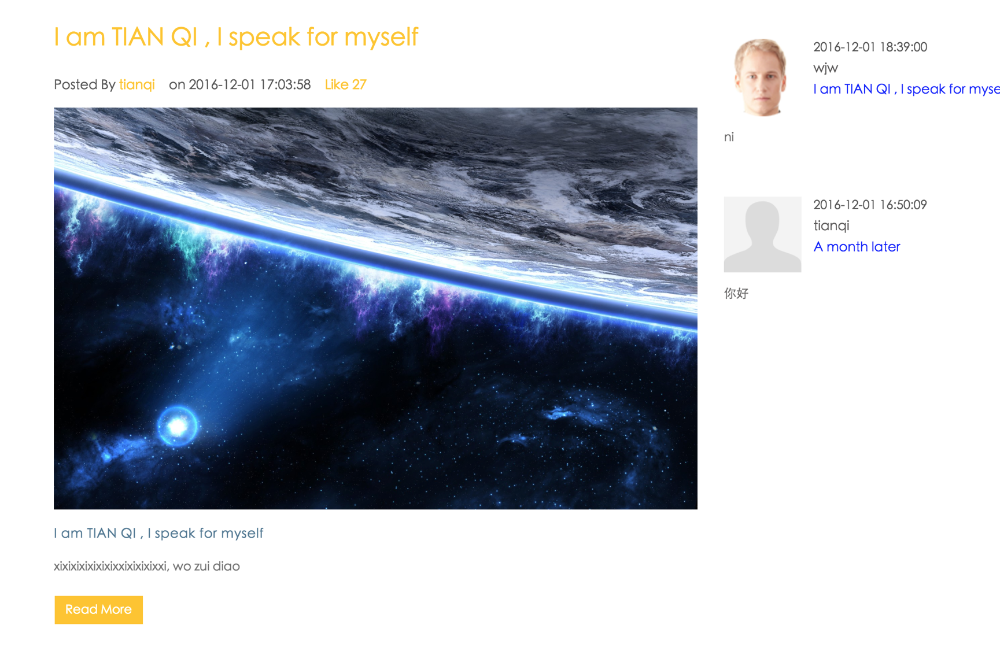

# ISPORTS

ISPORTS is a WEB homework coded in PHP. BUILD IN Laravel Framework.

Laravel is accessible, yet powerful, providing tools needed for large, robust applications. A superb inversion of control container, expressive migration system, and tightly integrated unit testing support give you the tools you need to build any application with which you are tasked.

## Official Documentation

Documentation for the framework can be found on the [Laravel website](http://laravel.com/docs).

一、项目介绍
ISPORTS 是一款基于Laravel框架的PHP项目。该项目主要是实现了运动管理、活动管理、用户管理、权限管理、统计分析、社交朋友圈、评论等。
功能定义如下：
1.	运动管理：个人运动数据的收集，显示等。基于restful的方式注入数据，模拟可穿戴设备的数据采集，模拟测试数据集不少于5千条，数据格式参考类似设备定义（xml格式），详情见设计文档中。
2.	活动管理：发布、修改、删除、参与等。类似参考网站的竞赛，简版。
3.	用户管理：账户设置，好友管理等。
4.	权限管理：个人用户经验系统。个人用户可进阶，不同等级用户可有不同功能权限。等级高的用户可以参加更高权限的竞赛，竞赛会涉及到不同权限登记。
5.	统计分析：对已上传数据的统计分析展示。
6.	社交：朋友圈功能，可以发表帖子，发送评论，图片评论等。

二、系统界面展示

主页

运动管理

历史数据展示

统计数据上传与分析

发布竞赛

个人竞赛全部内容

单个竞赛详情

朋友圈界面

朋友圈详情

朋友圈留言

用户管理，头像等信息输入

朋友圈发布

好友管理

关于与联系

声明：以上仅属于网站部分内容，不代表全部内容。更详细内容界面可以将项目部署后进行测试观看

三、系统代码展示
本系统采用laravel php框架，数据库基于sqlite。

详细代码在此不赘述，请参照代码原型

四、Web优化手段
1. html5+css3
本系统基于html5+css3
2. 跨浏览器兼容性

css中使用-webkit-border-radius 专门支持safari和chrome浏览器。-moz-border-radius支持火狐浏览器，使得不同浏览器之间兼容
3. 语义化
4.  SEO

meta中添加title，description等浏览器支持
5. 分众分类
6. css sprite

对头像等小文件进行合并使用css精灵压缩
7.	响应式web
由于本系统采用laravel框架，而laravel又使用了bootstrap框架，因此bootstrap本身就支持响应式的设计，支持移动端交互。
8.	正则表达式

在用户修改个人信息时，进行正则表达式匹配验证，是否符合输入规则
9.	js闭包
10.	设计模式
使用了MVC模型

控制，界面，与数据层相分离。
五、部署说明
由于本系统基于PHP的laravel框架，因此可以部署在任何laravel框架支持的服务器上。本系统在本机上使用了PHP7.0，Apache2.4服务器部署，使用了Sqlite3.4。
请将项目
Laravel 框架有对服务器有少量要求，当然，Laravel Homestead 已经满足所有这些要求，所以我们强烈推荐使用 Homestead 作为 Laravel 本地开发环境（Mac的话还可以使用Valet作为本地开发环境）。
不过，如果没有使用 Homestead，那么需要保证开发环境满足以下要求：
•	PHP版本 >= 5.6.4
•	PHP扩展：OpenSSL
•	PHP扩展：PDO
•	PHP扩展：Mbstring
•	PHP扩展：Tokenizer

PHP部署完善后，需要在机器中配置虚拟主机。VHOST，配置名称为ISPORTS即可。在此不再赘述

数据库部署请看 ‘config/database.php’
